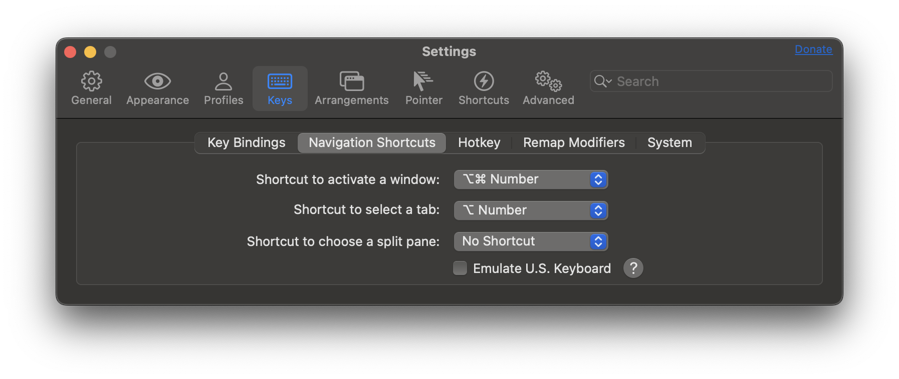
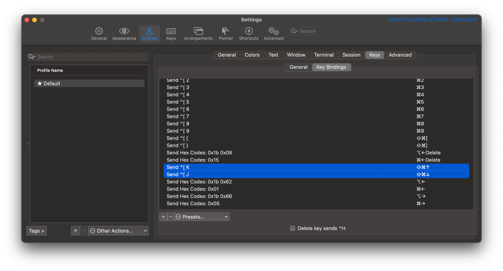

# tmux-for-claude

> Claude Code 등 AI 코딩 에이전트와 함께 쓰기 위해 최적화된 tmux 설정

여러 Claude Code 세션을 페인/윈도우로 띄워 놓고 동시에 작업할 때, **어느 창에서 작업이 끝났는지 한눈에 알 수 있도록** 설계된 tmux 환경입니다. Catppuccin macchiato 테마 기반에 한국어 IME 친화 단축키, copy-mode 시각 강조, 작업 완료 자동 감지, 멀티 윈도우 빠른 점프 등을 포함합니다.

## 핵심 기능

### 작업 완료 감지 및 시각 알림
- `monitor-silence` 1초 무출력 시 윈도우 인덱스 배경 노랑 발광 (3색 ping-pong)
- Claude Code **Stop hook** 연동으로 정확한 작업 완료 감지
- 다른 창에서 작업 중에도 어느 Claude가 무엇을 끝냈는지 즉시 파악
- `Prefix + Tab` — **다음 작업완료 윈도우로 순환 점프** (여러 작업 끝났을 때 줄줄이 처리)

### Prefix / Copy-mode 시각 통일감
- copy-mode 또는 prefix 활성 시 status bar 슬레이트 토글
- copy-mode 진입 시 상단 `󰍉 COPY MODE` + 스크롤 위치 `[현재/전체]` 바 (mauve pulse)
- pane border 색상 동기 강조
- prefix 누르면 status-right 좌측에 `⌘ PREFIX` 노란 박스

### 한국어 IME 친화 단축키
영문 모드의 표준 키(`c`, `l`, `n`/`p`)는 그대로 살리고, 한국어 모드에서도 동작하는 대체 키 추가:

| 키 | 동작 |
|---|---|
| `Tab` | 다음 작업완료 윈도우 점프 |
| `\` | last-window |
| `+` | new-window |
| `[` `]` `Left` `Right` | window 이동 |
| `Enter` | copy-mode 진입 |
| `BSpace` `DC` `x` | kill-pane (확인 popup) |

Copy-mode 종료도 IME 무관 — `Esc` / `q` / `Backspace` / `Delete` 모두 동작.

### 멀티 윈도우 빠른 점프 (iTerm2 + tmux)
| 키 | 동작 |
|---|---|
| `Cmd+0` ~ `Cmd+9` | window 0~9 직접 점프 |
| `Cmd+Shift+[` / `Cmd+Shift+]` | 이전/다음 window (크롬 탭 스타일) |
| `Cmd+Shift+↑` / `Cmd+Shift+↓` | 반페이지 스크롤 (copy-mode 자동 진입) |
| `Shift+←` / `Shift+→` | 이전/다음 window (prefix 없이) |

→ iTerm2 측 키 매핑 필요 (아래 [iTerm2 셋업](#iterm2-셋업) 참조).

### 깔끔한 윈도우 인디케이터
- chevron separator 제거된 사각 박스 형태
- 상태별 색상 구분:
  - 현재 창: mauve `#c6a0f6`
  - 다른 창에서 활성: dark purple `#7a5bb5`
  - 작업 완료(silence + Stop hook): yellow `#eed49f` 펄스
  - idle: gray (`@thm_overlay_2`)

### 화면 가운데 확인 popup
- `Prefix + x` / `BSpace` / `DC` 시 `Yes/No` 메뉴가 화면 정중앙 둥근 박스로 표시
- 한국어 IME 무관

### 카오모지 스피너
- status-right에 mauve 둥근 박스 안 카오모지 표정 표시 (`[•‿•]`, `[^_^]`, `[T_T]` 등)
- 30초 주기로 랜덤 회전 + mauve 음영 미세 변화
- 모든 프레임 단일셀 5문자로 통일되어 박스 폭 흔들림 없음

### 추가 편의 단축키
- `Prefix + |` / `-`: 페인 분할
- `Prefix + Shift+화살표`: 페인 이동
- `Prefix + y`: synchronize-panes 토글
- `Shift + ↑/↓` (prefix 없이): 5줄 스크롤 (자동 copy-mode 진입)
- `Ctrl+Shift + ↑/↓`: 반 페이지 스크롤
- copy-mode 안에서 `Shift+J/K`: 반 페이지 이동, `↑/↓`: 1줄 viewport 스크롤

## 요구사항

- **tmux 3.2+** (3.6 권장 — `pane_in_mode` 모든 위젯 컨텍스트 안정 평가)
- **Nerd Font** (powerline 글리프 ``, `` 및 catppuccin 아이콘 표시용)
- **True Color 지원 터미널** (iTerm2 / Ghostty / Wezterm / Kitty / Alacritty 등)
- **Bash, jq** (스크립트 / Stop hook transcript 파싱용)
- **Claude Code** (선택, Stop hook 연동 시)

## 설치

```bash
git clone https://github.com/bellship24/tmux-for-claude.git ~/tmux-for-claude
cd ~/tmux-for-claude
./install.sh
```

`install.sh`가 자동으로:
1. `~/.tmux.conf` + 5개 스크립트 심볼릭 링크 생성
2. 심링크 무결성 검증 (실패 시 즉시 에러)
3. `jq` brew 자동 설치 (없을 경우)
4. TPM(tmux 플러그인 매니저) 설치 (없을 경우)
5. Catppuccin 등 플러그인 자동 설치
6. 실행 중인 tmux 세션 즉시 reload

### Claude Code Stop hook 연동 (선택)

`~/.claude/settings.json` 의 `hooks` 항목에 추가:

```json
{
  "hooks": {
    "Stop": [
      {
        "hooks": [
          { "type": "command", "command": "~/.claude-stop-tmux.sh", "async": true }
        ]
      }
    ]
  }
}
```

전체 예시: [`examples/claude-settings.json`](examples/claude-settings.json)

## iTerm2 셋업

`Cmd+숫자` 등 macOS 스타일 단축키를 tmux 명령으로 받으려면 iTerm2 측 키 매핑 필요.

### 동작 원리

```
Cmd+1 누름
  ↓
iTerm2: ESC + "1" 시퀀스 전송 (= Alt+1)
  ↓
tmux: bind -n M-1 select-window -t 1  발동
  ↓
1번 윈도우로 점프
```

### 1단계: iTerm2 기본 탭 단축키 비활성

iTerm2 기본은 `Cmd+숫자 = Select Tab N` 으로 잡혀있어 우리 매핑보다 우선됨. 먼저 풀어주기.

`Settings → Keys → Navigation Shortcuts`:
- **Shortcut to select a tab**: `⌘ Number` → **`No Shortcut`** 또는 `⌥ Number`



### 2단계: Profile Keys 매핑 등록

`Settings → Profiles → Keys → Key Bindings → +` 으로 13개 등록:

**숫자 점프 (10개)**:
| Keyboard Shortcut | Action | Esc+ |
|---|---|---|
| `Cmd+0` ~ `Cmd+9` | Send Escape Sequence | `0` ~ `9` |

**크롬 탭 스타일 좌우 (2개)**:
| Keyboard Shortcut | Action | Esc+ |
|---|---|---|
| `Cmd+Shift+[` | Send Escape Sequence | `{` |
| `Cmd+Shift+]` | Send Escape Sequence | `}` |

**반 페이지 스크롤 (2개)**:
| Keyboard Shortcut | Action | Esc+ |
|---|---|---|
| `Cmd+Shift+↑` | Send Escape Sequence | `K` |
| `Cmd+Shift+↓` | Send Escape Sequence | `J` |

> Esc+ 필드엔 **한 글자만**. iTerm2 가 자동으로 ESC를 prepend.



### 검증

tmux 안 zsh 프롬프트에서:

```bash
cat
```

Cmd+1 누름 → 화면에 `^[1` 찍히면 OK. `Ctrl+C` 로 종료. tmux 윈도우 1번 점프 확인.

### 안 되면

| 증상 | 원인 | 해결 |
|---|---|---|
| 화면에 아무것도 안 찍힘 | iTerm2/macOS 가 Cmd+숫자 가로챔 | Navigation Shortcuts 비활성 (1단계) |
| `^[ 1` (공백) | Esc+ 필드 공백 입력됨 | 항목 더블클릭 후 공백 제거 |
| `^[1` 정상이지만 점프 안 됨 | tmux escape-time 짧음 | `tmux.conf` 에 `set -s escape-time 50` 추가 |

## 디렉토리 구조

```
tmux-for-claude/
├── tmux.conf                       # 메인 설정 (~/.tmux.conf 로 링크)
├── scripts/
│   ├── tmux-spinner.sh             # status-right 카오모지 스피너
│   ├── tmux-pulse-mauve.sh         # COPY MODE 바 발광 효과 (mauve 3색 ping-pong)
│   ├── tmux-pulse-yellow.sh        # 작업완료 윈도우 발광 효과 (yellow 3색)
│   ├── tmux-jump-completed.sh      # 다음 작업완료 윈도우 순환 점프
│   └── claude-stop-tmux.sh         # Claude Code Stop hook
├── examples/
│   └── claude-settings.json        # Claude Code settings.json 예시
├── docs/
│   └── screenshots/                # iTerm2 셋업 스크린샷
├── install.sh                      # 셋업 자동화
├── LICENSE                         # MIT
└── README.md
```

## 디자인 노트

### Copy-mode / Prefix 시각 통일

```
copy-mode 또는 prefix 활성
   │
   ├─ pane_in_mode || client_prefix → 1
   │
   ├─ status-style          → bg=#54586e (slate)
   ├─ status-right          → 슬레이트 박스
   ├─ window-status-format  → 텍스트 영역 슬레이트
   ├─ pane-border-style     → 슬레이트 (copy-mode 한정)
   │
   └─ pane-mode-changed hook → pane-border-status top 토글
```

훅은 **`pane-border-status` 토글 1회만** 담당. 나머지 색상은 모두 format conditional 자동 평가.

### 색상 팔레트 (catppuccin macchiato + custom)

설정 상단 `@_c_*` user var 로 일원화. 색상 변경 시 정의 한 줄만 수정하면 전체 반영.

| 용도 | 색상 |
|---|---|
| 현재 창 | mauve `#c6a0f6` |
| 다른 창 활성 | dark purple `#7a5bb5` |
| 작업 완료 (silence + Stop hook) | yellow `#eed49f` |
| idle | gray (`@thm_overlay_2`) |
| copy-mode/prefix slate | `#54586e` |
| status bar bg (평시) | mantle `#1e2030` |
| prefix indicator box | yellow `#eed49f` |

## 호환성 노트

- **macOS / Linux**: 동작 확인 (저자 환경: macOS 14+ / iTerm2 / tmux 3.6)
- **WSL**: 별도 검증 안 됨, 동작할 것으로 예상
- **SSH 원격**: tmux 영속성 활용에 가장 적합한 환경

### cmux와의 차이

[cmux](https://cmux.com/)는 macOS 전용 GUI 터미널로 AI 에이전트용 작업 환경을 1급 기능으로 제공합니다. 이 repo는 다음 환경/취향에 적합합니다:

- macOS 외 플랫폼 (Linux, Windows/WSL)
- SSH/원격 서버에서의 Claude Code 사용
- 기존 tmux 사용자의 워크플로우 유지
- 깊은 커스터마이징을 원하는 경우

## 라이선스

[MIT](LICENSE)
